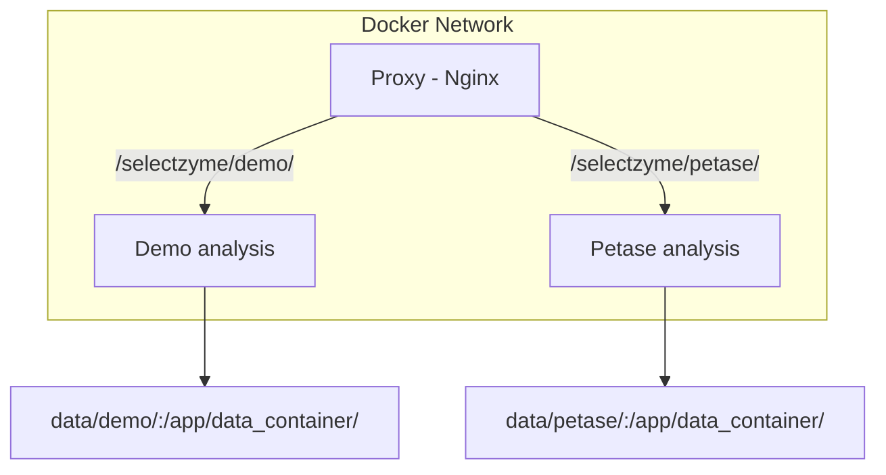
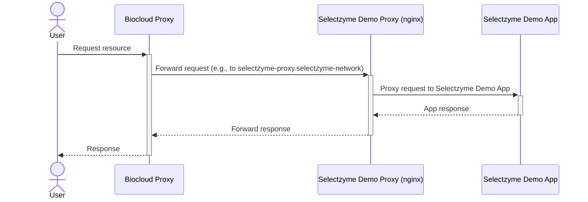

# SelectZyme-app
Web application to host the pre calculated analyses by SelectZyme.

## Install
Prerequisite for all installs is to clone the repository.
```
git clone https://github.com/ipb-halle/SelectZyme-app.git
cd SelectZyme-app
```

### Docker
#### Run all case studies (serve SelectZyme server)
```
docker-compose up
docker-compose down  # shut down services
```
Access the server from your browser at: `localhost/selectzyme/`

### Local install to run a single case study
Install dependencies defined in the `pyproject.toml` and SelectZyme without dependencies.
```
pip install .
pip install --no-dependencies git+https://github.com/ipb-halle/SelectZyme.git
```
Usage: 
```
python app.py  # runs example analysis 'demo' by default
python app.py -i=petase
```
`-i=` specify the case study to load. Available case studies are listed [here](https://huggingface.co/datasets/fmoorhof/selectzyme-app-data/tree/main) with their names (here as an example petase).
Access the server for your analysis from your browser at: `localhost:8050`

## Architecture


## Server deployment @ IPB
Target server: [biocloud](https://biocloud.ipb-halle.de/)
Service: [SelectZyme](https://biocloud.ipb-halle.de/selectzyme/)

In order to automatically (re-)start the service (e.g. with a cronjob) please perform these steps:
```
./sz.sh install  # register service 1st time
./sz.sh start
systemctl status sz.service  # test status
./sz.sh stop  # stop service
```
Use `sz.sh update` to update the service.

Additional notes on the current workflow to build docker images with a workflow:
Because of a restricted company network, images (github: packages) are build using a CI workflow. The packages appear in the repo on the right, clicking on them you can change the visibility. They should inherit visibility from the repo but the company can have restrictions so ask the organization owner to enable public visibility of your package (image).


* Changes: Biocloud proxy sits on top of SelectZyme proxy


## Development
This project uses the following tools to improve code quality:
- [ruff](https://docs.astral.sh/ruff/tutorial/)

Ocean server development (ocean_ip)
http://ocean_ip/selectzyme/demo/


# License
MIT License