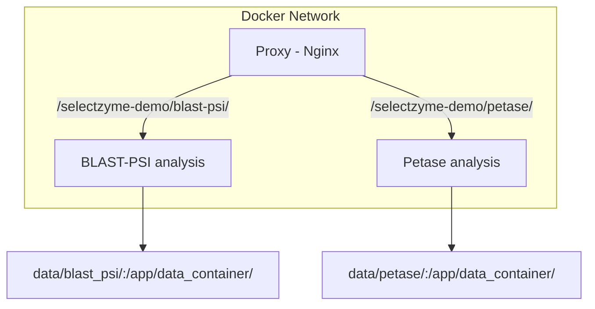

# SelectZyme-demo-app
Minimal demonstration of pre-calculated analyses to show usage and utility of SelectZyme.



## Install
Prerequisite for all installs is to clone the repository with the corresponding submodule SelectZyme.
```
git clone --recurse-submodules https://github.com/ipb-halle/SelectZyme-demo-app.git
cd SelectZyme-demo-app
```
*Troubleshooting:
if you forgot to clone with `--recurse-submodules` you can do it later via: `git submodule update --init`
if you want to leave the latest stable commit hash and use a newer version of selectyme (core functionality), update the submodule to the latest commit:
`git submodule update --recursive --remote`

### Docker
Requires cloning the repository (see above).
```
docker build -t ipb-halle/selectzyme-demo-app:development .
```
#### Run all case studies (reproduces SelectZyme server)
```
docker-compose up
docker-compose down  # shut down services
```
Access the server from your browser at: `localhost/selectzyme-demo/`


#### Run only individual Container
```
docker run -it --rm -p 8050:8050 ipb-halle/selectzyme-demo-app:development --input_dir=/app/data/blast_psi
```
Access the server for your analysis from your browser at: `localhost:8050`

### Local install
Install dependencies defined in the `pyproject.toml` and SelectZyme without dependencies.
```
pip install .
pip install --no-dependencies external/selectzyme/
```
Usage: 
```
python app.py  # runs example analysis by default
python app.py -i=/your/out_files/from/selectzyme_backend
```
Access the server for your analysis from your browser at: `localhost:8050`

## Development
This project uses the following tools to improve code quality:
- [ruff](https://docs.astral.sh/ruff/tutorial/)

# License
MIT License